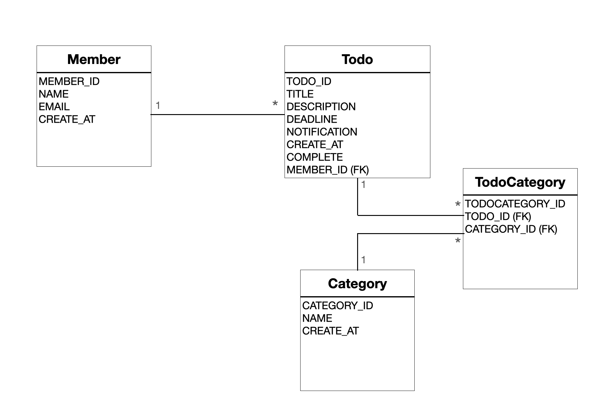

# <center>투두리스트</center>

### <center>스프링MVC와 JPA를 이용한 첫 프로젝트</center>

<br />

## DataBase

#


<br />
<br />
<br />

## <strong>TodoList 기능</strong>

#

### 회원

- 회원 등록
- 회원 로그인
- 회원 로그아웃

### 카테고리 기능

- 카테고리 등록
- 카테고리 조회
- 카테고리 삭제

### 투두 기능

- 할일 등록
- 할일 조회
  - 멤버별로 찾기
  - 카테고리 별로 찾기
- 할일 삭제
- 할일 수정
  - 할일 타이틀 수정
  - 할일 완료 처리
    <br />
    <br />
    <br />

## <strong>개발 스택</strong>

#

### Front-End

- Thymleaf

### Back-End

- Spring (gradle로 빌드)
- JPA
- H2 Database
  <br />
  <br />
  <br />

## <strong>프로젝트 실행 방법</strong>

### 1. 프로젝트 경로로 이동

### 2. ls -al 입력

```
❯ ls -al
total 64
drwxr-xr-x@ 16 yeonkyu  staff   512 Oct  4 01:38 .
drwxr-xr-x   6 yeonkyu  staff   192 Sep 21 11:37 ..
drwxr-xr-x  12 yeonkyu  staff   384 Oct  8 17:56 .git
-rw-r--r--@  1 yeonkyu  staff   444 Sep 13 15:09 .gitignore
drwxr-xr-x   6 yeonkyu  staff   192 Sep 13 22:11 .gradle
drwxr-xr-x  12 yeonkyu  staff   384 Oct  5 11:13 .idea
-rw-r--r--@  1 yeonkyu  staff  1554 Sep 13 15:09 HELP.md
-rw-r--r--   1 yeonkyu  staff    18 Oct  8 17:59 README.md
drwxr-xr-x   6 yeonkyu  staff   192 Sep 13 22:15 build
-rw-r--r--@  1 yeonkyu  staff  1198 Oct  3 12:27 build.gradle
drwxr-xr-x@  3 yeonkyu  staff    96 Sep 13 15:09 gradle
-rwxr-xr-x@  1 yeonkyu  staff  5774 Sep 13 15:09 gradlew
-rw-r--r--@  1 yeonkyu  staff  2763 Sep 13 15:09 gradlew.bat
drwxr-xr-x   4 yeonkyu  staff   128 Oct  2 23:06 out
-rw-r--r--@  1 yeonkyu  staff    30 Sep 13 15:09 settings.gradle
drwxr-xr-x@  4 yeonkyu  staff   128 Sep 13 15:09 src
```

### 3. gradle 빌드

```
./gradlew build
```

### 4. h2 Database 실행

```
ls h2_199/bin
./h2.sh
```

### 5. 빌드 폴더로 이동하여 빌드된 파일 확인

```
cd build/libs
❯ ls | grep jar
todolist-0.0.1-SNAPSHOT-plain.jar
todolist-0.0.1-SNAPSHOT.jar
```

### 6. 실행

```
java -jar todolist-0.0.1-SNAPSHOT.jar
```

<br />
<br />
<br />

## <strong>프로젝트를 통해 배운점</strong>

#

- Spring 프레임워크, Spring MVC, JPA를 배운 후 첫 프로젝트 이다.
- 회사에서의 업무가 인프라 아키텍트이다보니 개발할 일이 없어서, 배워야 겠다 라고 생각해서 배웠더니, 확실히 쉽지 않다.
- 우선 컨트롤러 부분에서 많은 시행착오가 있었다. AJAX를 쓰고 싶어서 구글링하면서 적용했는데, 왠지 AJAX 쓰려면 REST API 같은 형식으로 컨트롤러를 짜야될 것 같다.
- 그리고, 코드가 가독성이 좋지 않다. 중복된 것도 많고, 조금 더 효율적으로 할 수 있을 것 같은데, 더 공부해야 겠다.
- 그리고 Database 설계를 처음 해보았는데, 처음에는 대충 이정도면 되겠지 했는데, 프로젝트를 진행하면서 수정해야할 부분이 많았다. 인프라도 그렇지만, DB는 첫 설계가 중요할 듯 하다.
- 다음 프로젝트는 게시판을 만들어 볼 예정이다. 기술 스택은 그대로 가져갈 생각이고, 이번엔 MySQL로 한번 해볼까 생각한다. 프론트엔드도 일단 Thymleaf로 가져가고, 추후에 vueJS나 reactJS로 해서 REST API 방식으로 해볼까? 생각 중이다.
